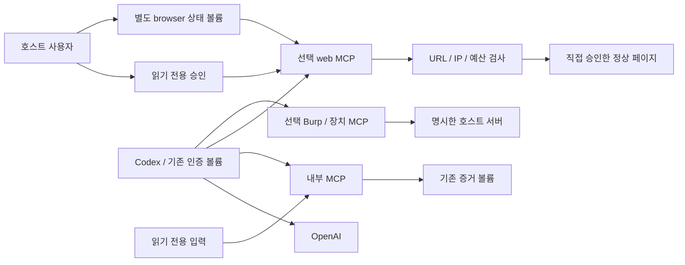

# 보안 모델과 경계

## 신뢰와 네트워크

호스트 운영자가 입력·승인·설정을 관리합니다. 모델, 페이지, 소스 주석, 도구 출력은 승인 주체가 아닙니다. 호스트 TTY 승인 파일은 모델에게 쓰기 마운트되지 않습니다. 이 파일이 사람임을 암호학적으로 증명하는 구조는 아니며 호스트/Docker 관리자는 신뢰합니다.

- analysis/platform/android/binary는 internal 네트워크를 사용하며 외부 URL, XML 참조, registry/CVE DB를 조회하지 않습니다.
- observer에는 관찰 egress, Burp/장치 어댑터에는 host adapter egress를 별도로 설정합니다.
- MCP 포트는 호스트에 게시하지 않습니다. SDK Host/Origin 검사와 64 KiB 입력 제한을 적용하지만 사용자 인증을 대체하지 않습니다. 단일 사용자 내부 네트워크용이며 별도 OAuth는 없습니다.
- Codex의 web_search 비활성화, shell_tool=false, read-only 설정은 모델 도구 설정입니다. **목적지별 OS/컨테이너 egress 방화벽은 미구현**입니다. Docker 격리의 실제 실행도 미검증입니다.
- 선택 소스 발췌와 정제된 결과는 모델 제공자에게 전달될 수 있습니다. 원본 인증·브라우저 상태 볼륨은 Codex MCP로 읽을 수 없습니다.

## 관찰 승인과 전송

호스트가 계획을 표시하고 TTY 확인 문구를 받아 15분 유효한 일회용 승인을 만듭니다. MCP 승인 도구나 --yes 플래그는 없습니다.

정확한 scheme/host/port/path/query URL 목록을 검사하고 제외 규칙을 먼저 적용합니다. 사용자정보 URL, 모호한 경로, 제어문자, 일부 상태 변경 경로/민감 query는 거부합니다. 이름 필터만으로 GET의 무해함을 증명할 수 없으므로 운영자가 정상 행동을 선택해야 합니다.

각 요청은 승인 존재/변경/만료, URL, DNS 주소, 예산을 검사한 뒤 검증한 숫자 IP로 연결합니다. TLS SNI/인증서 검증은 원래 호스트를 사용합니다. 리다이렉트는 다음 전송 전에 검사합니다. 사설/loopback/link-local/metadata 주소는 기본 차단이며 세션 계획에는 allow_private_targets와 정확한 private_cidrs를 함께 요구합니다. 이전 grant 형식은 기존의 명시적 CIDR 정책을 유지합니다.

세션 관찰은 GET/HEAD/OPTIONS와 정확한 호스트 승인 body 해시의 POST만 허용합니다. GraphQL mutation/remote introspection은 차단합니다. Cookie/Authorization은 선택 identity의 credential_origin에만 보내고 다른 origin에서는 제거합니다. anonymous는 둘 다 보내지 않습니다. Set-Cookie도 해당 account origin만 프로필에 반영합니다.

## 예산과 중단

세션의 6개 예산 기본/상한은 USAGE.md의 표에 있습니다. 기본 30회/분, 동시 2, 총60회, 본문8 MiB, 응답2 MiB, 45초입니다. 현재 네트워크 전송은 직렬 처리하며 동시 값은 상한입니다. 기존 read/browser의 총30회/45초/8 MiB/2 MiB 제한도 유지됩니다.

Content-Length와 실제 읽은 본문 모두 제한합니다. TLS/헤더/커널 버퍼 바이트는 본문 카운터에 포함하지 않습니다. 압축 응답은 지원하지 않고, 길이 미상 응답이 한도와 같으면 보수적으로 불완전 처리할 수 있습니다.

서비스당 동시에 한 관찰, grant당 한 번입니다. research_pause는 이후 전송을 멈추고 runtime 예산은 계속 흐릅니다. 이미 전송 중인 요청은 취소되지 않을 수 있습니다. research_resume는 같은 승인/남은 예산만 사용합니다. research_abort는 부모가 worker와 자식 프로세스 그룹을 종료한 뒤 worker_terminated를 반환합니다. 중단된 job은 재개하지 못합니다. 기존 stop_web도 유지합니다.

요청 시작/응답/차단/종료는 UUID 감사 기록에 남습니다. 강제 종료 후 최종 합계가 불완전할 수 있습니다. 서비스 재시작 후 메모리의 job 상태는 사라지지만 저장된 증거는 읽을 수 있습니다.

## 브라우저 상태와 관찰 한계

anonymous/user_a/user_b는 별도 0700 persistent 디렉터리와 flock을 사용합니다. browser-sessions-v1은 입력/증거/승인/Codex 인증과 분리합니다. storage-state 가져오기는 호스트 CLI만 지원하고 초기 1회 파일을 독점 생성합니다. MCP에 원본 쿠키/token API는 없습니다. 디렉터리 분리는 OS 사용자 분리나 저장 암호화가 아닙니다.

SPA에서는 초기 navigation과 JS가 만드는 정상 fetch/XHR/API/resource를 관찰합니다. WS는 opening handshake 후 닫고 프레임은 전달하지 않습니다. SSE는 유한 snapshot입니다. 서비스 워커/다운로드/자동 클릭/폼은 사용하지 않습니다. raw 응답·스크린샷은 증거로 저장하지 않습니다.

브라우저의 HTTP 요청은 route를 통해 검증 transport로 이행하고, 직접 proxy egress와 QUIC/non-proxied WebRTC는 비활성화합니다. Chromium의 모든 부수 통신을 OS 방화벽으로 차단했다거나 Chromium sandbox를 별도 활성화했다고 주장하지 않습니다. 컨테이너는 non-root/cap_drop/no-new-privileges를 설정합니다.

## 파일·native·host 어댑터

SafeRoot는 openat/dir_fd/O_NOFOLLOW와 일반 파일 검사로 경로/링크/FIFO 우회를 막습니다. 기본 파일16 MiB, 소스 트리64 MiB/500항목/깊이12, ZIP 2048항목/128 MiB/압축비100입니다. JSON/YAML 깊이32/노드100000, YAML alias/XML entity를 제한합니다.

고정 Python worker, shell=False, 제한된 환경과 부모 절대 timeout을 사용합니다. 일반 분석 주소 공간1 GiB/30초, MCP 결과512 KiB입니다. Java native 분석은 별도 8 GiB 주소 공간/768 MiB heap과 생성 파일/시간 상한을 적용합니다. SPA/native worker의 개별 파일 상한64 MiB는 Chromium DB/임시 분석 파일을 위한 것이며 MCP 출력 상한은 그대로입니다.

JADX/Ghidra는 읽은 입력의 사본, 검토된 고정 명령, 새 임시 프로젝트만 사용합니다. 원본 앱/실행파일, target scripts/install/build/hooks를 실행하지 않습니다. 다만 파서/JVM 자체 취약점까지 방어하는 제품은 아닙니다.

Burp는 실제 tools/list 후 검토된 기존 history만 읽고, 장치 도구는 명시한 host 서버의 선택 metadata만 읽습니다. 임의 shell/Frida JS/attach/replay는 없습니다. 자세한 네트워크/결과 한계는 ADAPTERS.md에 있습니다.

## 증거·비밀·후보·보존

새 기록은 UUID/fsync/link 방식으로 저장하고 이전 파일을 덮어쓰지 않습니다. provenance에는 ID, UTC, 입력 SHA-256(없는 경우 null), analyzer/pipeline version, identity, 결과 상대 경로, redaction 상태를 기록합니다. source view의 해시는 정렬된 입력 manifest일 수 있고 inventory는 입력 전체를 해시하지 않습니다. 실제 parser/native 버전은 health 또는 결과에도 표시합니다.

HAR/HTTP/SPA/Burp는 원문 credential/query/body scalar 값을 제외합니다. source context는 최대80행이며 민감 패턴 행을 숨깁니다. **임의 JSON key, URL/path, 파일명, binary string, device tag/process명, 자유 텍스트의 모든 개인정보 제거는 보장하지 않습니다.** 출력 전 수동 privacy review가 필요합니다.

후보는 DISCOVERED, VALIDATING, NEEDS_MORE_EVIDENCE, REJECTED, BLOCKED_SCOPE, DUPLICATE, NOT_SECURITY_RELEVANT, READY_FOR_HUMAN_REVIEW를 사용합니다. 기존 lowercase 상태는 호환용으로 읽고 받을 수 있습니다. CONFIRMED는 거부하며 자동 제출은 없습니다.

Codex auth/session/config는 기존 볼륨에 유지합니다. initializer는 config가 없을 때만 생성하고 진단은 login status의 원문을 버립니다. 공식 logout은 사용자가 호출한 계정 동작입니다. Docker 로그는 none이며 외부 터미널 녹화는 통제하지 못합니다. 기존 연구/인증/증거 및 ZIP을 이동·삭제·덮어쓰기하지 않습니다. 디스크 quota/장기 보관/관리자 변조 탐지 서명은 운영자 영역입니다.
